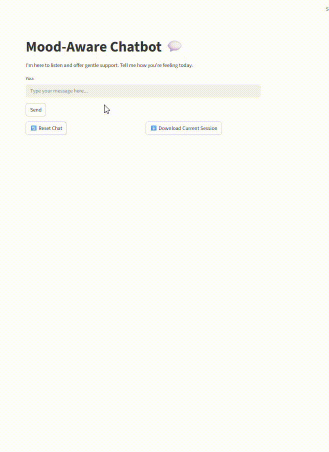

# AI Mental Wellness Companion 💬

A mood-aware chatbot designed to listen, respond empathetically, and track your emotional state over time.
Built with Streamlit, TextBlob, and Matplotlib for real-time mood visualization and session tracking.

## Features

* Conversational AI
  * Chat naturally with the bot, which responds based on mood and intent.

* Mood Detection
  * Tracks whether your messages are positive, neutral, or negative.

* Mood Analytics

  * Visualizes your mood trends over the current session. Shows the users:

    * Current positive streak

    * Dominant mood for the session
      * Note: The Current Session Mood displays the most frequently occurring mood throughout the conversation, providing an at-a-glance summary of the overall emotional tone.

    * Mood trend chart

* Mood Visualization
  *  Tracks your mood throughout the session and shows trends in a graph.

* Session Tracking
  *  Save conversations and mood stats to mood_history.txt.

* Positive Streaks
  *  Highlights your current positive streak messages for motivation.

* Download Current Session
  *Download a .txt file summarizing your current session, including:

    * Number of messages
  
    * Mood of each message
  
    * Dominant mood for the session

* Reset & Save: Easily reset the chat or save the session at any time.

## Installation

Clone the repository:

<pre>git clone https://github.com/hpdnnr7/AI-Mental-Wellness-Companion.git
cd AI-Mental-Wellness-Companion</pre>

Create a virtual environment (optional but recommended):

<pre>python -m venv venv
source venv/bin/activate  # macOS/Linux
venv\Scripts\activate     # Windows</pre>

Install dependencies:

<pre>pip install -r requirements.txt</pre>

Run the app locally:

<pre>streamlit run app.py</pre>

## Usage

1. Type your message in the input box and press Send.

2. View AI responses and mood analytics on the page.

3. Click 🔄 Reset Chat to clear the chat while keeping session data internally.

4. Click ⬇️ Download Current Session to save your current session to a text file.

Note: This app does not store user data permanently. All session data is local unless you download it manually.

## Screenshots

Chat interface with AI responses

Mood trend visualization for the current session

## Deployment

The app is deployed on Streamlit Cloud:
[Live App Link](https://ai-mental-wellness-companion-uhf6kft7ebd4n3awrn7s3u.streamlit.app/)

## Saved Sessions

All sessions are saved in mood_history.txt in the following format:
<pre>
Session - 2025-11-14T10:48:00
Messages: 10
Moods: positive, negative, neutral, ...
Summary: 4 positive, 3 neutral, 3 negative
------------------------------------------------------------
</pre>
